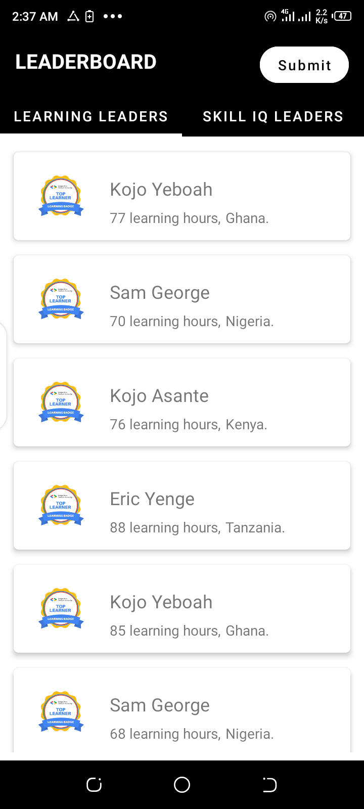
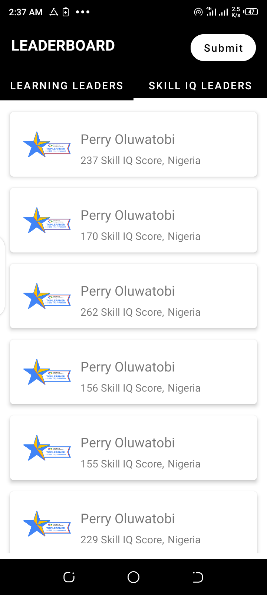
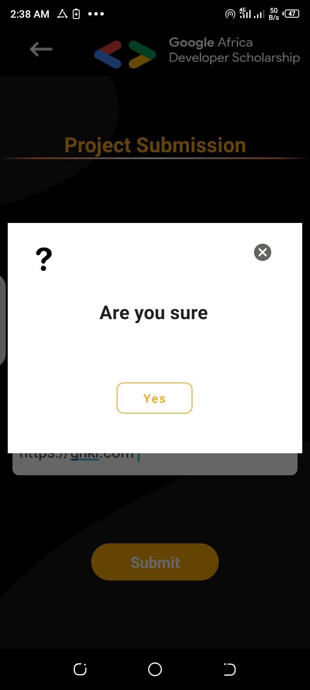
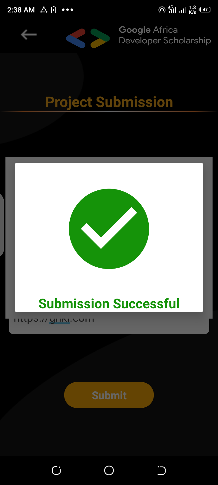
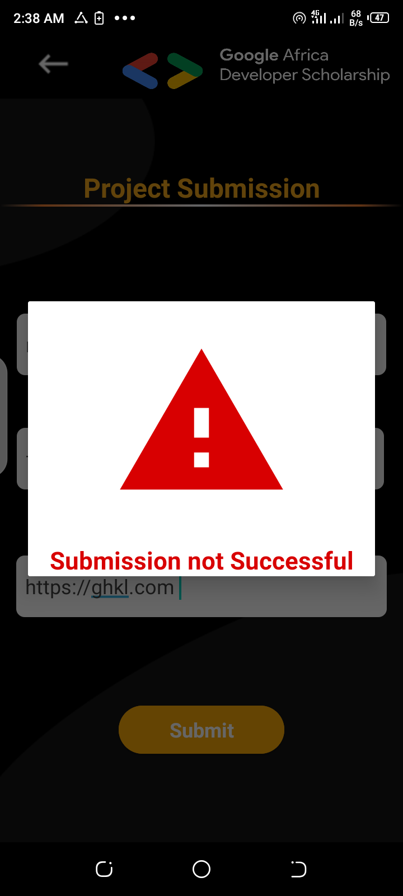

# LEADERBOARD
This is a practice project, which is part of the Google Africa Development Program 2020.

## Functionalities
- The app queries APIs for the top 20 learning learners as well as top 20 skill IQ learners of the GADS 2020 Leaderboard.
- It uses Retrofit to get data from the server and also post data to google form.

### Below are screenshots that depict the functionalities of the app:

